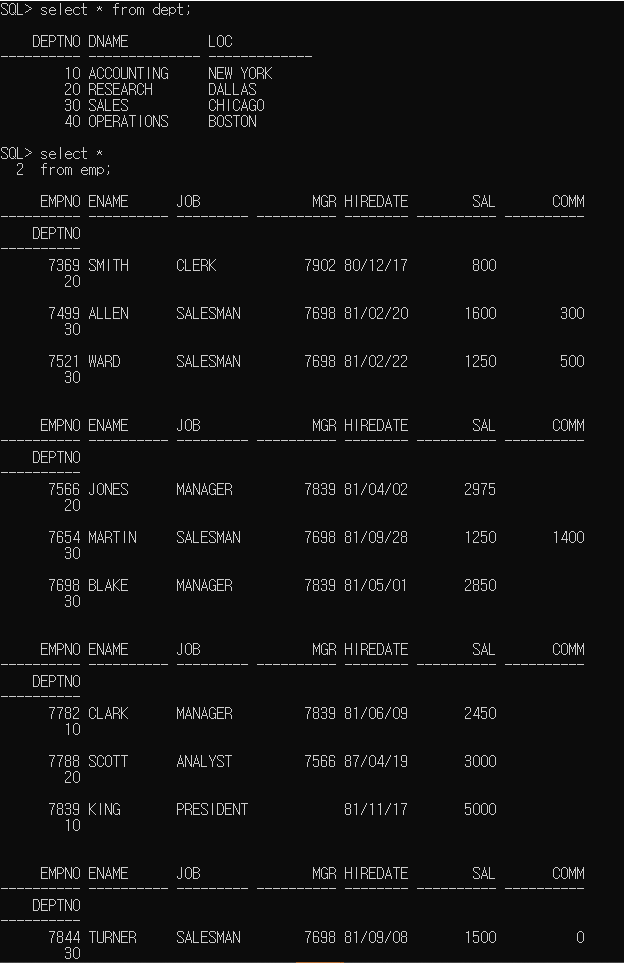

SQL의 기본 개요

트랜잭션에 대하여  

> 사용자 : Unit of Work
>
> 시스템 : 분리되어 수행할 수 없는 전체가 완전수행 또는 수행하지 않는 것 
>
>  https://k39335.tistory.com/28

DML, DDL, DCL, TCL (※oracle 에 국한, 다른 곳에서 비슷할 수 도 다를 수도  )

> DML - 데이터 검색, 추가, 수정, 삭제
>
> 
>
> DDL - 테이블 생성, 구조 변경, 삭제
>
> DCL - 권한 부여, 권환 회수
>
> TCL - Transaction (저장, 취소)

키(Primary Key, Foreign Key)의 종류와 함수적 종속

> 출처: https://futurists.tistory.com/14 [미래학자]

SQL 설치 

> 주어진 파일 압축 해제후(1번에 2번 병합) setup.exe실행 
>
> 팝업 메시지 등장시 '예' 클릭 
>
> 보안갱신 구성 - 설치옵션 - 시스템 클래스 까지 건너뛰고 
>
> 기본 설치에서 관리 비밀번호 설정 : oracle 입력 
>
> >  Linux - root
> >
> > mySQL - root
> >
> > Oracle - sys 이런 내용들은 삭제 불가 

SQL 프롬프트 실행

> ```
> cmd>
> C:\Users\student>sqlplus /nolog
> --관리자로 DB 접속
> SQL> connect sys/oracle as sysdba   --conn  / as sysdba
> --샘플 계정 비밀번호 설정 및 잠긴 계정 풀기
> 
> ```

> 
>
> 
>
> ```
> SQL> alter user scott
>          identified by oracle
>         account unlock;
> 
> SQL> alter user hr
>          identified by oracle
>         account unlock;
> --scott 샘플계정으로 database에 연결
> SQL> conn scott/oracle     --connect scott/oracle
> SQL> select user from dual;
> --scott 소유의 테이블 목록 확인(조회)
> SQL> select tname from tab;
> SQL> select table_name from user_tables;
> --테이블 구조 조회(컬럼명, 순서, 타입, 크기)
> SQL> describe emp    --desc emp
> ```
>
> 
>
> 
>
> ```
> --테이블의 모든 컬럼과 레코드를 조회
> SQL> select * from dept;
> SQL> select  *
>         from emp;
> ```
>
> 
>
> (*사진 짤림 : 중략)
>
> ```
> --테이블의 특정 컬럼만 조회 (테이블에 선언된 컬럼 순서와 무관하게 조회할 수 있다)
> select ename, sal, job
> from emp;
> ```
>
> 
>
> 
>
> ```
> --컬럼 연산 (메모리에서 연산 후 결과 fetch됨, DB에 저장된 data에 영향 주지 않음)
> select ename, sal, sal*12
> from emp;
> ```
>
> 
>
> 
>
> ```
> --컬럼별칭(alias)은 컬럼 heading을 rename 역할
> select ename, sal, sal*12 as salary
> from emp;  
> ```
>
> 
>
> 
>
> ```
> --as 생략 가능, 컬럼 heading 대소문자 구분 가능
> select ename, sal, sal*12   "Annual Salary"
> from emp;
> ```
>
> 
>
> 
>
> ```
> --number타입의 컬럼에는 산술연산 가능
> --data타입 컬럼에는 정수와의 +, - 연산 가능
> --data타입 컬럼간에는 - 연산 가능
> --char, varchar2 문자열 컬럼에는 결합연산(||) 가능
> 
> select deptno
> from emp;  --14rows
> 
> select distinct deptno
> from emp ;  ---중복제거 후 unique한 값만 fetch함
> ```
>
> 


