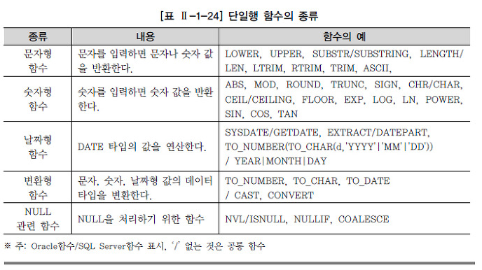

#### SQL을 이용한 함수 구현 

들어가기 앞서

45강 내용 복습 (Review)

```
selection검색 - where 조건 
where 컬럼 (비교)연산자 비교값
 비교 연산자 , 범위연산자 (between 하한값 and 상한값), in (값 리스트), like '% _', is null, is not null
논리 연산자 not and or
heap(일반) table은 insert한 순서대로 block에 저장되며, 조회 결과는 block에 저장된 순서대로 반환됩니다.
order by  :조회 결과를 특정 컬럼기준으로 정렬
order by 컬럼 정렬방식(asc|desc)
order by  표현식  정렬방식(asc|desc)
order by 별칭 정렬방식(asc|desc)
order by 컬럼 position 정렬방식(asc|desc)
```

일반적인 프로그래밍 언어 -'절차적인 언어' 라 지칭(처리과정 기술)

> 조건처리, 반복처리, 변수처리, 예외처리 

SQL 언어 - 결과지향적 언어, 선언적 언어(과정 기술 X)

> 초창기 SQL은 과정기술이 없기에 조건처리X, 반복처리X, 변수X, 예외처리도X → 여러가지 제약사항  
>
> - 함수의 등장 
>
> > SQL을 powerful 하게 사용 가능하도록 해줌 
> >
> > : 복잡한 계산, 조건처리, 타입 변환, 포맷 형식 변환 등 
> >
> > 데이터베이스에서의 함수는 '반드시 1개의 값을 리턴' 해야 한다. 

SQL 함수

> * predefine function(내장함수) 
>
> > 단일행 함수
> >
> > 
> >
> > > 문자함수
> > >
> > > ```sql
> > > -- ascii-127개문자 
> > > -- ebcdic-256개문자
> > > select chr(48), chr(65), chr(97), chr(13)
> > > from dual;
> > > 
> > > select upper('hello'), lower('HELLO'), initcap('HELLO SQL')
> > > from dual; --HELLO hello Hello Sql
> > > 
> > > select concat('hello' ,  ' SQL')
> > > from dual;  --hello SQL
> > > 
> > > select substr('hello world', 6), substr('hello world', 3,2)
> > >         , substr('hello world', -5, 3)
> > > from dual;  -- world 11 wor
> > > 
> > > select replace('Jack and Jue', 'J', 'Bl')
> > > from dual;  --Black and Blue
> > > 
> > > select  instr('hello world', 'o'), instr('hello world', 'o', 6)
> > >          , instr('hello world', 'o', 1, 2) , instr('hello world', 'o',-5)
> > > from dual;   --5 8 8 5
> > > 			--값의 존재 유무를 체크할 때 유용함 
> > > 
> > > select length('korea'), length('대한민국'),
> > >        lengthb('korea'), lengthb('대한민국')
> > > from dual;  -- 5 4 5 8
> > > 
> > > -- REGEXP 계열 함수들 
> > > -- https://docs.oracle.com/cd/B19306_01/server.102/b14200/functions001.htm
> > > -- 이하 hr 계정 연결 
> > > 
> > > --sql plus창 사용시 
> > > conn hr/oracle
> > > desc employees
> > > select phone_number from employees;
> > > 
> > > SELECT
> > >   REGEXP_REPLACE(phone_number,
> > >                  '([[:digit:]]{3})\.([[:digit:]]{3})\.([[:digit:]]{4})',
> > >                  '(\1) \2-\3') "REGEXP_REPLACE"
> > >   FROM employees
> > >   ORDER BY "REGEXP_REPLACE";
> > > 
> > > 
> > > SELECT country_name,
> > >   REGEXP_REPLACE(country_name, '(.)', '\1 ') "REGEXP_REPLACE"
> > >   FROM countries;
> > > 
> > > 
> > > SELECT
> > >   REGEXP_SUBSTR('500 Oracle Parkway, Redwood Shores, CA',
> > >                 ',[^,]+,') "REGEXPR_SUBSTR"
> > >   FROM DUAL;
> > > 
> > > SELECT REGEXP_COUNT('123123123123123', '(12)3', 1, 'i') REGEXP_COUNT
> > >    FROM DUAL;
> > > SELECT REGEXP_COUNT('123123153123123', '(12)3', 1, 'i') REGEXP_COUNT
> > >    FROM DUAL;
> > > 
> > > 
> > > SELECT
> > >   REGEXP_INSTR('500 Oracle Parkway, Redwood Shores, CA',
> > >                '[^ ]+', 1, 6) "REGEXP_INSTR"
> > >   FROM DUAL;
> > > ```
> > >
> > > 숫자함수
> > >
> > > ```sql
> > > select round(1234.567, 2), round(1234.567, 0), round(1234.567, -2)
> > > from dual; --1234.57 1235 1200
> > > 
> > > select trunc(1234.567, 2), trunc(1234.567), trunc(1234.567, -2)
> > > from dual; -- 1234.56 1234 1200
> > > 
> > > select mod(100, 35), remainder(100, 35)
> > > from dual; -- 30 -5
> > > 
> > > select ceil(34.56), floor(34.56), power(2, 10)
> > > from dual; --35 34 1024
> > > 
> > > 
> > > --예제(다시 Scott계정으로 접속)
> > > Q> emp테이블로부터 82년도에 입사한 사원 조회
> > > select * 
> > > from emp 
> > > where HIREDATE like '87%';
> > > 
> > > --또는 
> > > select *
> > > from emp 
> > > where '87' = substr(hiredate, 1, 2); --hiredate 형식 확인 
> > > 
> > > 
> > > Q> emp테이블로부터 사번이 홀수인 사원 조회
> > > select ename 
> > > from emp 
> > > where 1 = mod(empno, 2);
> > > ```
> > >
> > >  
> > >
> > > 날짜 함수
> > >
> > > ```sql
> > > select ename, hiredate, months_between(sysdate, hiredate)
> > > from emp;
> > > 
> > > select ename, hiredate, trunc(months_between(sysdate, hiredate), 'Month')
> > > from emp;
> > > 
> > > select  trunc(to_date('2021/7/16'), 'Month') 
> > >         , trunc(to_date('2021/7/14'), 'Month') 
> > >         , trunc(to_date('2021/7/16'), 'Year') 
> > >         , trunc(to_date('2021/6/16'), 'Month') 
> > > from dual;   --round함수도 날짜 타입에 적용 가능 함수(절삭기능) 
> > > 
> > > 
> > > select sysdate, add_months(sysdate, 3)
> > > from dual; --20/02/05 20/05/05
> > > 
> > > alter session set nls_date_format = 'RR/MM/DD HH24:MI:SS'; -- 형식전환(session 변경)
> > > select sysdate, current_date, current_timestamp, sessiontimezone
> > > from dual;
> > > --sysdate함수는 시스템(운영체제)의 현재 시간을 date타입값으로 반환
> > > --current_date 함수는 DB접속 client 세션의 timezone기반으로  date타입값으로 반환
> > > alter session set time_zone='-9:00'; -- 표준timestamp 기준 9시간 빠른 서울의 시간 표시  
> > > 
> > > select sysdate, current_date, current_timestamp, sessiontimezone
> > > from dual;
> > > 
> > > select dbtimezone from dual; --원복
> > > alter session set nls_date_format = 'RR/MM/DD'; --원복 
> > > 
> > > select last_day(sysdate), last_day(to_date('1900/02/03'))
> > >       ,last_day(to_date('2000/02/03')),last_day(to_date('1996/02/03'))
> > > from dual; --2월의 last day활용, 윤년확인 
> > > 
> > > select  next_day(sysdate, '금'), next_day(sysdate, '월')
> > > from dual; --20/02/07 20/02/10
> > > 
> > > select hiredate, extract( month from hiredate)
> > > from emp; --좌측열 HIREDATE에서 우측열에 월 추출 
> > > 
> > > select hiredate, extract( day from hiredate)
> > > from emp; --좌측열 HIREDATE에서 우측열에 일 추출 
> > > 
> > > --날짜 시간 관련 컬럼 타입
> > > --timestamp with timezone
> > > --interval year to month
> > > --interval day to second
> > > 
> > > 
> > > select hiredate, hiredate + TO_DSINTERVAL('100 00:00:00') 
> > > -- day to second 
> > >      , hiredate + to_yminterval('01-02') --year to month 
> > > from emp;
> > > ```
> > >
> > > 일반함수(null 처리 함수, 조건처리 함수 )
> > >
> > > ```sql
> > > --null처리 함수
> > > --nvl(arg1, arg2) : if arg1 is not null then return arg1
> > >                        else return arg2
> > >                        반드시 arg1, arg2가 동일한 타입이어야 함
> > > --nvl2(arg1, arg2, arg3)) :   if arg1 is not null then return arg2
> > >                                    else return arg3
> > >                        반드시 arg2, arg3가 동일한 타입이어야 함
> > > --coalesce(arg1, arg2,......argn) :  if arg1 is not null then return arg1
> > >                                          else if arg2 is not null then return arg2
> > >                                          ....
> > >                        null아닌 argument를 리턴하고 함수는 종료
> > > 
> > > select nvl(comm, 'No Commission')
> > > from emp; ---error
> > > select nvl(to_char(comm), 'No Commission')
> > > from emp; 
> > > 
> > > Q> emp테이블에서 commission을 받는 사원은 sal+comm 리턴하고, 
> > > commission을 받지 않는 사원은 sal 리턴한 결과 출력
> > > select ename, sal, comm, nvl2(comm, sal+comm, sal)
> > > from emp;
> > > 
> > > select coalesce(1,2,3,4,5), coalesce(null, null, 3,4,5), coalesce(null, null, null, null, 5)
> > > from dual; -- 1 3 5 
> > > 
> > > -------------------------------------
> > > 
> > > -- 조건처리 : decode(),  표준sql 구문 case when then ...else end
> > > Q> 10번 부서 사원은 급여를 5%인상, 
> > >       20번 부서 사원은 급여를 7%인상, 
> > >      30번 사원은 급여를 3%인상된 급여를 현재급여와 함께 출력
> > > select ename, deptno, sal
> > >         , decode(deptno, 10, sal*1.05, 20, sal*1.07, 30, sal*1.03, sal) "Increase"
> > > from emp; --네번째 col로 Increase 생성, 부서별 증가된 액수로 값 반환 
> > > 
> > > --또는(표준 sql구문으로 처리) 
> > > select ename, deptno, sal
> > >         , case deptno when 10 then sal*1.05
> > >                       when 20 then sal*1.07
> > >                       when 30 then sal*1.03
> > >                       else sal end "Increase"
> > > from emp; 
> > > 
> > > Q> 급여에 대한 세금을 급여와 함께 출력하시오
> > > 급여가 1000미만이면 세금 0원
> > > 급여가 1000이상 2000미만이면 세금 급여의 5%
> > > 급여가 2000이상 3000미만이면 세금 급여의 10%
> > > 급여가 3000이상 4000미만이면 세금 급여의 15%
> > > 급여가 4000이상 이면 세금 급여의 20% 
> > > 컬럼 별칭은 Tax
> > > 
> > > select ename, deptno, sal
> > >         , decode(trunc(sal/1000), 0, 0,
> > >                                  1, sal*0.05,
> > >                                  2, sal*0.1,
> > >                                  3, sal*0.15,
> > >                                  sal*0.2) "Tax"
> > > from emp;
> > > 
> > > --또는 
> > > select ename, deptno, sal
> > >         , case when sal<1000 then 0
> > >                when sal<2000 then sal*0.05
> > >                when sal<3000 then sal*0.1
> > >                when sal<4000 then sal*0.15
> > >                else sal*0.2 end "Tax"
> > > from emp; 
> > > ```
> > >
> > > 
> > >
> > > 형변환(converion) 함수 
> > >
> > > ```sql
> > > select sysdate, to_char(sysdate, 'YYYY"년" MM"월" DD"일" Day')
> > > from dual; --to_char의 1번째 argument 값 형식과 변환할 두번째 argument값 형식은 달라도 변환됨
> > >            --20/02/05  2020년 02월 05일 수요일 
> > > 
> > > select 1234.56, to_char(1234.56 , '$999,999.990')
> > > from dual; --1234.56  $1,234.560
> > > 
> > > select '$1,234.56' , to_number('$1234.56' , '999,999.990')
> > > from dual; ---error, 수치부적합
> > > 
> > > select '$1,234.56' , to_number('$1,234.56' , '$999,999.990')
> > > from dual;   -- $1,234.56   1234.56
> > > 
> > > 
> > > ```
> > >
> > > 
> >
> > 복수행 함수(group 함수)
> >
> > ```sql
> > --테이블 전체 레코드를 하나의 그룹으로 함수에 적용
> > --테이블의 레코드를 특정 컬럼으로 그룹핑하고 그룹핑된 레코드들에 함수 적용
> > --count(), min(), max(), sum(), avg(), stddev(), variance()
> > select count(sal), min(sal), max(sal), sum(sal), avg(sal), stddev(sal), variance(sal)
> > from emp;  
> > --count(), min(), max()는 모든 컬럼타입 적용 가능
> > select   count(hiredate), min(hiredate), max(hiredate)
> > from emp; 
> > 
> > select   count(ename), min(ename), max(ename)
> > from emp; 
> > 
> > --count는 null이 아닌 컬럼값의 개수를 리턴
> > --count는 인수로 *를 사용할 수 있음=> 테이블의 행수를 리턴 (not null제약조건이 선언된 컬럼값의 개수 계산 리턴)
> > select count(*), count(comm), count(deptno), count(distinct deptno)
> > from emp;
> > 
> > --avg
> > --※ 그룹함수는 null을 함수 계산에 포함하지 않습니다. (무시)
> > select avg(comm),sum(comm)/count(empno)
> > from emp; --comm컬럼에 null 포함 
> >           --계산 결과가 다르다. 
> >           
> > -- 전체 사원의 commision 평균을 구하고자 수정한다면?
> > select avg(nvl(comm,0)), sum(comm)/count(empno) --null값을 먼저 제어
> > from emp; --두 col이 동일하게 출력 
> > 
> > Q. 어떤 컬럼이 모두 null인 경우 count 함수의 결과는? 
> > alter table emp add (address varchar2(50));
> > desc emp; 
> > select empno, ename, address from emp; --address 컬럼 전부 null
> > select count(address) from emp; -- 0이 반환된다. 
> > 
> > Q. 어떤 컬럼이 모두 null인 경우 sum 함수의 결과는? 
> > alter table emp drop(address);
> > alter table emp add(price number(6));
> > desc emp
> > select empno, ename, price from emp; --price 컬럼 전부 null
> > select sum(price) from emp; -- null 이 반환된다. 
> > 
> > 
> > --그룹핑 실행
> > select deptno, avg(comm), sum(comm)
> > from emp; ---error, 단일 그룹의 그룹 함수가 아닙니다. 
> > 
> > select deptno, avg(comm), sum(comm)
> > from emp
> > group by deptno;
> > 
> > --1차 그룹된 레코드에 2차 그룹핑 적용 가능 
> > select deptno, job, avg(comm), sum(comm)
> > from emp 
> > group by deptno, job;
> > 
> > --예제
> > Q. 각 부서별 평균 급여가 2500 이상인 부서와 해당 부서의 급여 평균을 검색 출력하시오 
> > select deptno, job, avg(sal), sum(sal)
> > from emp
> > where avg(sal) >= 2500
> > group by deptno; --error, where절은 gruop by 전에 수행되며, 그룹함수 사용불가 
> > 
> > --그룹함수의 조건 지정, group by 후에 수행
> > select deptno, avg(sal), sum(sal)
> > from emp
> > group by deptno
> > having avg(sal) >= 2500;
> > 
> > 
> > conn hr/oracle -- 이하 문제 hr계정으로 접속 
> > 
> > Q> employees 테이블의 department_id, salary 컬럼...
> > 부서별 급여의 평균을 평균의 내림차순으로 출력하도록 SQL 작성
> > select  department_id, avg(salary)
> > from employees
> > group by department_id
> > order by 2 desc;
> > 
> > Q>  employees 테이블의 department_id, salary, manager_id 컬럼...
> > 관리자가 있는 사원들을 관리자로 그룹핑해서 동일한 관리자로부터
> > 관리를 받는 피관리자의 최소 급여가  6000미만인 사원의 관리자와 최소급여를 출력하는 SQL 작성
> > select  manager_id, min(salary)           ----5
> > from employees                            ----1
> > where manager_id is not null              ----2
> > group by manager_id                       ----3
> > having min(salary) < 6000                 ----4
> > order by 2 desc;                          ----6
> > 
> > ```
> >
> > 
> >
> > window(분석함수)
> >
> > - grouping된 row들에 대한 일정한 연산 처리 범위 (→ windows)함수
> >
> > ```
> > select 함수 over (partition by ~ order by ~ [nulls last | nulls first])
> > 	   rows| range current row, unbound preceding, unbound following 
> > from 
> > where
> > (group by) → 통상 partition by 로 대체 	
> > order by
> > 
> > #순위 함수 
> > #집계 함수 
> > #행 순서 
> > #비율 관련 함수 
> > #상관분석, 선형회귀, ...분석 함수 
> > ```
> >
> > 
> >
> > 통계 함수
>
> 
>
> * custom function(사용자 지정함수)

※ 집합 연산자(set operator)

```sql
-- 교집합, 합집합, 차집합 등의 개념 존재 
conn hr/oracle 
desc employees --hr계정의 employees 데이터 소스를 활용하 것임 

select count(*) from employees; --현재 근무하고 있는 사원들의 정보(107)

desc job_history 
select count(*) from employees; --사원들이 과거에 근무 이력 정보(10)


Q. 사원들의 현재 근무정보와 과거 근무 정보를 모두 출력하는 SQL 생성 
--Union 사용 
select employee_id, department_id, job_id 
from employees
union
select employee_id, department_id, job_id 
from job_history; 


Q. 사원들의 현재 근무정보와 과거 근무정보를 모두 출력하되 동일한 직무와 부서에서는 근무인 경우 한번만 출력하는 SQL 작성
select employee_id, department_id, job_id
from employees
union 
select employee_id, department_id, job_id
from job_history; ---()

Q. 사원들의 현재 직무를 관거에 동일한 직무를 수행했던 사원번호, 직무를 출력하는 SQL 작성 
select employee_id, job_id 
from employees 
intersect 
select employee_id, job_id
from job_history;

Q. 사원들중에서 입사한 이후 한번도 부서나 직무를 변경한 적이 없는 사원번호를 출력하는 SQL 작성 
select employee_id
from employees
minus 
select employee_id 
from job_history


--set연산자를 사용하는 select문에서는 set연산자와 함께 사용되는 select문중 마지막 select문에서만 선언 가능합니다.
select employee_id,   job_id
from employees
order by job_id desc
intersect
select employee_id,   job_id
from job_history;  --error

select employee_id, job_id
from employees
intersect 
select employee_id, job_id
from job_history
order by job_id desc;

Q> 전체 사원의 급여 평균과
     부서별 사원들의 급여 평균과
      부서와 직무별 사원들의 급여 평균을 단일 결과 집합으로 생성하는 SQL을 작성하시오
      
select to_number(null), to_char(null),avg(salary) --select가 안맞는 부분은 임의의 null로 채워주기 
from employees
union all --중복된 열이 없으므로 연산 최소화 
select department_id, to_char(null), avg(salary)
from employees
group by department_id
union all
select department_id, job_id, avg(salary)
from employees
group by department_id, job_id;

--또는 (rollup으로 간단하게 바꾸어보자)
select department_id, job_id, avg(salary)
from employees
group by rollup(department_id, job_id); --department_id job_id avg(salary)
--(규칙)--
select ~
from ~
group by rollup (A,B)
→ group by A,B
→ group by A
→ group by ()

select ~
from ~
group by rollup (A,B,C)
→ group by A,B,C
→ group by A,B
→ group by A
→ group by ()


-- 대상이 4개 일때 
Q> 전체 사원의 급여 평균과
     부서별 사원들의 급여 평균과
     직무별 사원들의 급여 평균과
      부서와 직무별 사원들의 급여 평균을 단일 결과 집합으로 생성하는 SQL을 작성하시오

select to_number(null), to_char(null),avg(salary)
from employees
union all
select department_id, to_char(null), avg(salary)
from employees
group by department_id
union all
select to_number(null), job_id, avg(salary)
from employees
group by  job_id
union all
select department_id, job_id, avg(salary)
from employees
group by department_id, job_id;

-- cube 로 대체 
select department_id, job_id, avg(salary)
from employees
group by cube(department_id, job_id);


Q. 전체 사원의 급여 평균과 
    부서별 사원들의 급여 평균과 
    관리자와 직무별 사원들의 급여 평균과 
    부서별 관리자별 사원들의 급여 평균을 단일 결과 집합으로 생성하는 SQL 작성 
select department_id, job_id, avg(salary)
from employees
group by grouping sets((department_id, manager_id, job_id), 
                       (department_id),
                       (department_id, manager_id), 
                       (department_id, job_id));


```


#### 상기 기재 내용 sql 3장, 4장, 5장, 8장의 슬라이드 확인 

