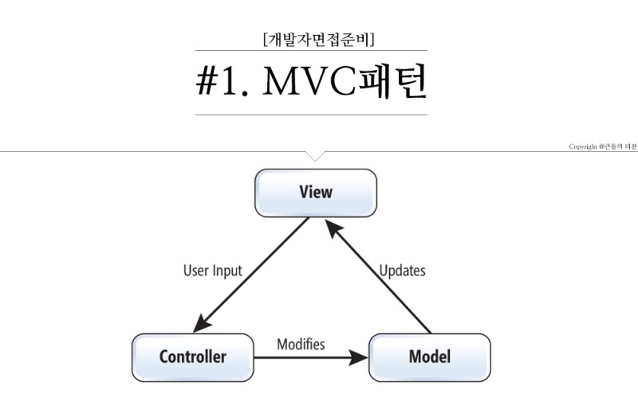

#### MVC모델 기반 

> **M** - Model (Data의 관리, 영속성)
>
> **V**- View (표현, 시간화) → html 
>
> **C** - Controller 




> - View에서 Controller에 사용자 요청을 보내면 Controller는 사용자 제공을 구행한다. 
> - Controller에서 Model에 비즈니스 로직, Data처리 등을 요청하면 Model은 결과를 반환한다. 


**복습 **

> - 파이썬 urllib.parse.urlencode()에 name가 value로 구성된 Query String을 만듦 

``` python
# 파라미터를 url에 함께 전송 요청하고 응답 출력 실습 
import urllib.request 
import urllib.parse

params = urllib.parse.urlencode({'userid': '홍길동', 'userpwd': 1234 })
print('URL 인코딩이 적용된 문자열 : %s' %params)
url = 'http://70.12.116.160:8080/login/data/jsp?%s' % params
with urllib.request.urlopen(url) as f:
	print(f.read().decode('utf-8'))
```

``` 결과 
출력결과 

URL 인코딩이 적용된 문자열 : userid=%ED%99%8D%EA%B8%B8%EB%8F%99&userpwd=1234


<!DOCTYPE html>
<html>
<head>
<meta charset="utf-8">
</head>
<body>
<center>
홍길동님 반갑습니다.<br>
Fri Feb 21 09:29:08 KST 2020 오늘은 쒼나는 주말 시작입니다. 주말동안 ADSP 시험준비 철저...<br>
 </center>
</body>
</html>
```


