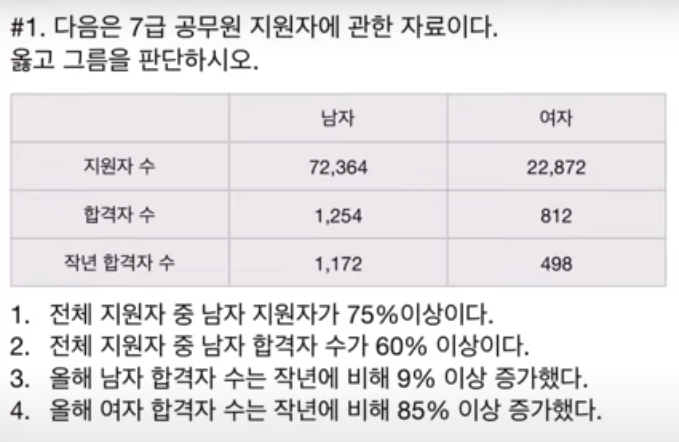

### 자료해석 시간단축법

출처: https://www.youtube.com/watch?v=YWiG4Hru0J0&t=14

#### 1. 여집합 활용

> - 자료 해석 문제중에는 두 개의 항목 값을 비교하는 문제가 많다(ex/ 전체 중 한 항목의 비율)
> - 전체 값을 구해서 나누기를 하기 보다는 여집합을 활용하는 것이 훨씬 빠르고 정확 
> - 예시 
>
> > 
> >
> > * 전체에서 남자가 75%이상 = 전체에서 여자는 25%이하 즉, 이때 '여자*3 =< 남자' 로 풀이에 접근

#### 2. 인수분해

> 
>
> - <보기>의 ㄱ처럼, 중소기업에서 400W의 전기를 사용하는 경우를 가정 원래대로라면 150(kw)x100 + 150(kw)x200 + 100(kw)x400 으로 계산
> - 이처럼 누진세가 적용되는 문제는 인수분혜를 활용하면 계산을 빨리할 수 있다. → 150x100(1+2+2/3x4)  

#### 3. 최댓값, 최소값 변환

> |          | A    | B    | C    | D    | E    | F    |
> | -------- | ---- | ---- | ---- | ---- | ---- | ---- |
> | 전체비용 | 76   | 68   | 59   | 72   | 83   | 91   |
> | 개수     | 8241 | 6914 | 5476 | 7346 | 8426 | 7345 |
>
> - Q. 개수당 비용이 가장 작은 상품은?
>
> > * 나누기를 (상대적으로 용이한) 곱셈으로 바꿔주는 것이 팁 
> > * 즉, <u>비용당 개수가 가장 큰 상품</u>을 구하라는 말과 동일(역수)  
> > * 전체 비용해서 몇을 곱했을 때 전체비용이 나오는지 구할 것 
> > * 전부 곱할 필요는 없고, 가장 큰 개수를 곱할 것으로 보이는 A로 집계

#### 4. 가평균

> | 학생 | A    | B    | C    | D    | E    | F    | G    | H    | I    | J    |
> | ---- | ---- | ---- | ---- | ---- | ---- | ---- | ---- | ---- | ---- | ---- |
> | 점수 | 78   | 82   | 76   | 80   | 90   | 74   | 82   | 84   | 75   | 81   |
>
> - Q. 전체 학생수의 평균을 구하라
>
> > * 10명의 학생의 점수대가 대략적으로 80 언저리에 분포하는 것을 알 수 있음
> > * 즉, 80에 대한 각 학생별 점수의 편차를 정리 
> > * 편차의 합을 모두 더함(위 문제의 경우는 2가 도출)
> > * 즉 80*10/10(전체값) 에서 2를 더해주면 됨 = 82

#### 5. 가중평균

> |        | 남자 | 여자 | 전체 |
> | ------ | ---- | ---- | ---- |
> | 투표율 | 80%  | 40%  | 50%  |
>
> - Q. 남자, 여자의 인구비는?
>
> - 전체값(50%)을 받침점으로 하는 시소를 만든다. 이때, 중심점과 각 대상과의 거리는 서로 반대로 집계한다(y:x)
> - 남자와 전체값과의 거리는 30, 여자와 전체값과의 거리는 10이므로, 남자와 여자의 인구비는 1:3(남자:여자)이 된다. 

